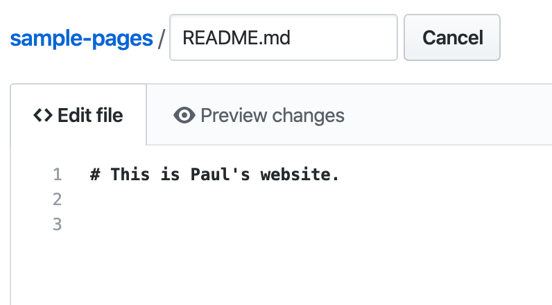
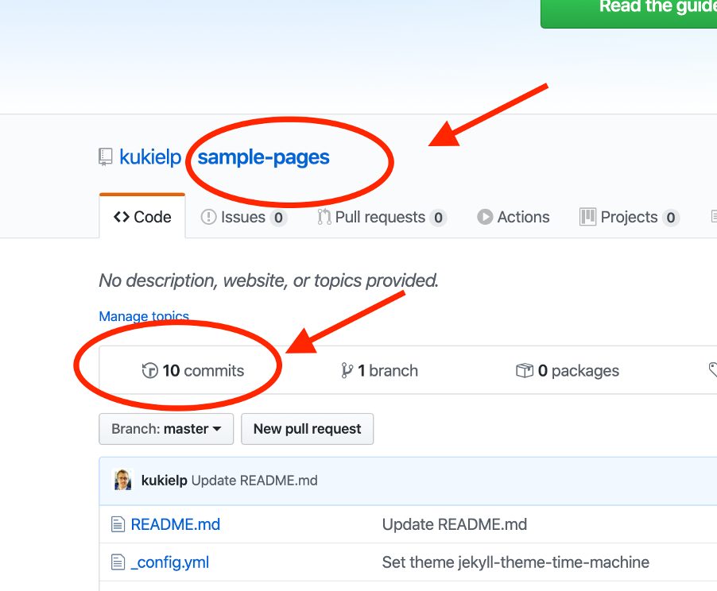
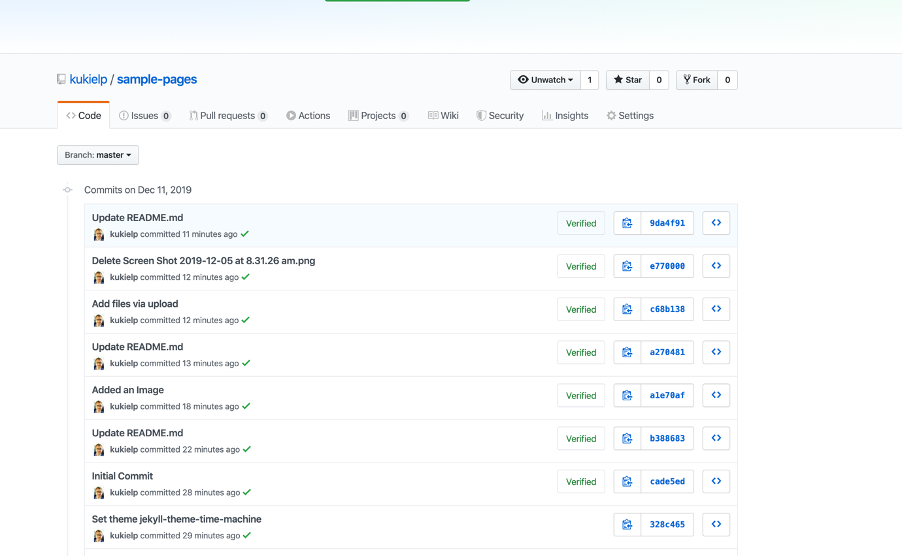

# Make your own website

1. Visit:  https://pages.github.com/
    
2. In the same tab Visit:  https://github.com/new
    
3. Choose a “Repository Name” this will form part of the URL.
4. Ensure “Initialize this repository with a `README.md`” is selected.
5. It should look like the image below:
    
6. Scroll down to “GitHub Pages”, change source to “Master Branch”
        
7. The page will reload, scroll down again to “Themes” then click “Choose a Theme”. From here you can choose a theme:
    
8. Then click “Select Theme:
    
9. You are then back at the “Code editing section” to edit the Markdown. Scroll down and add a comment “Initial Commit” then click “Commit Change”, leave “Commit directly to master branch” selected:
    
10. You have now made the initial commit and GitHub will “build” the website.  You can view the website by clicking “Settings” then scrolling down to “GitHub Pages”:
    
11. You will then see a URL:
    
12. Right click on this URL and open in a new tab. You will see that you have a “Website”. Change back to the original tab with the “Code”.  The `README.md` file is the code for your website.  We can edit this in the browser by clicking the “Pencil Icon”.
13. In a third Tab open https://github.com/adam-p/markdown-here/wiki/Markdown-Cheatsheet this is a code cheat sheet. We will reference this later. Swap back to the “Code tab”. Delete all the code and make a heading. If we refer to the “Cheat Sheet” tab we can see that a hash ( # ) a the start means, create a heading, is is the code.
    
14. Scroll down and fill in the Comment with “Making this my own” then click “Commit Changes”. Change to the URL of your website, wait 2 mins and click refresh.  You will see the website has been rebuilt. Change back to the tab with the “Code”. 
15. We will now upload an image to your website.  Click “Upload Files” , click “Choose your files” Ensure the image you are using is renamed to “myimage.jpg” Select an image from your computer and wait for it to upload.  Enter some text in the commit message “Added an image”.
    
16. Then click “Commit Changes”. Swap back to the URL tab and refresh a few times.  The website has rebuild but we cant see the image.  Why is this? The answer is that our code is not referencing the image we will now embed the image into the website. Swap to the code tab end click the pencil icon again, we are now in edit mode.
Enter the following code:
    ```
    # This is Paul's website.
    This is my image:
    
    ```
    
17. Scroll down and enter some commit text “Change the code to reference my image”. Then click “Commit Changes”. Then swap back to the URL tab and refresh the page. You will now see your website.
    
18. Have a look at :  https://github.com/adam-p/markdown-here/wiki/Markdown-Cheatsheet and make some other changes following the pattern.
After each “Commit” refresh the URL page to see your website published.
Practise 3-5 times.
Once you are comfortable, we can now look at what a “Commit” is.
Click on the root of your project:
Then click “X Commits” link.
    
19. You will see a list of commits:
    
20. Click on one of the numbers, you can see the “Diff”. Git is tracking your changes so you can role back if you make a mistake.  Version control is very important, all code must be version controlled:
    
21. You now know how to make a GitHub pages website, program in MarkDown, add images, Commit code and view the diffs.  Not bad for 1 hour.